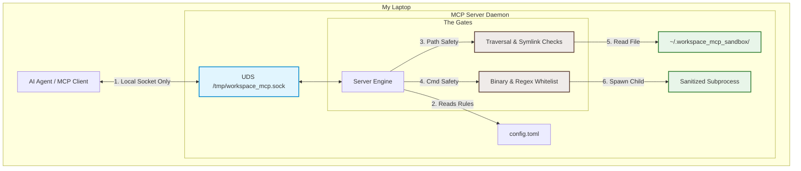

# Writing a Secure Local MCP Server

To play around with local MCPs I built a toy **Secure Local Workspace MCP Server**. 

The goal is simple: let the agent read files and execute commands, but wrap everything in a "secure-ish" sandbox so it can't blow up my laptop.

## 🏗️ The System at a Glance

Here’s the basic flow. The client (like Claude Desktop) connects to the server, and the server acts as the gatekeeper, validating commands against a strict local `config.toml` file.

## 🔒 The Core Security Decisions (And Why I Made Them)

I wanted to show clean systems-level coding without overcomplicating things. Here are the four main areas I locked down:

### 1. Unix Domain Sockets for the transport layer
* **The Decision**: The server binds to `/tmp/workspace_mcp.sock` instead of a local TCP port like `127.0.0.1:8080`.
* **Why**: TCP loopback ports are hard to secure. They are vulnerable to DNS rebinding, and any local script or open browser tab on your machine can ping them. By using a Unix Domain Socket, the server has zero network exposure. Plus, I can rely on standard macOS/Linux file permissions to control who is allowed to talk to the socket.

### 2. Blocking sneaky paths (`read_isolated_file`)
* **What**: Enforce strict path canonicalization and reject all symlinks.
* **Why**: If you let an agent read files, it *will* eventually try to read `/etc/passwd` or use relative path escapes like `../../secret.txt`. 
  - To stop this, the server resolves all user inputs to their absolute, canonical paths and verifies they actually start with the allowed sandbox directory. 
  - Even sneakier is when the agent (or a file inside the sandbox) creates a symbolic link pointing to a file outside. To handle this "symlink racing" vector, the server walks up both the resolved and unresolved path components and rejects the operation immediately if it detects a symlink at any level.

### 3. Sanitized command spawning (`execute_job`)
* **What**: Avoid shell execution, whitelist absolute binaries, and validate arguments with regex.
* **Why**: 
  - Spawning a shell (`shell=True` in Python) could lead to command-injection attacks. Instead, I bypass the shell entirely and pass arguments directly as a list to the executable. 
  - The server only recognizes commands explicitly defined in `config.toml` (e.g. mapping `"ls"` to `/bin/ls`). 
  - To keep things tight, every argument is verified against regular expression patterns. If the agent tries to run `git log --upload-pack` (which can execute arbitrary code) and the regex only allows `^log(\s+-n\s+\d+)?$`, it gets shut down immediately.
  - Finally, I strip all environment variables. The child process runs with an empty, safe environment containing only a default `PATH`. This ensures it can't read my private AWS keys, SSH agents, or system tokens.

### 4. Hammering hanging processes (Timeouts)
* **What**: Wrap every execution in an async timeout.
* **Why**: If the agent runs `sleep 99999` or starts an interactive prompt that waits for user input forever, it will hang the server. The server runs processes asynchronously using `asyncio` and forces a hard timeout. If it exceeds the limit, it aggressively kills the process (`proc.kill()`) and cleans up resources.

---

## 🔮 Potential extensions

Since this is a toy project, I left room for some improvements:

### More actions
Right now, the server is read-only. An obvious next step is to implement:
- **`list_isolated_directory`**: Secure directory listing.
- **`write_isolated_file`**: Writing files to the sandbox with the same symlink-racing protections.
- **`delete_isolated_file`**: Safe file deletion.

### Kernel-level containerization
Environment stripping is great, but the child process still runs as the host user. I could wrap executions in:
- **macOS `sandbox-exec`**: Using Apple’s native sandbox profiles to deny network access and restrict file writes.
- **Linux `bubblewrap` (bwrap)**: Running commands inside isolated user namespaces with a read-only root.

### Log streaming & Pseudo-TTYs (PTY)
Instead of waiting for a long test run or compiler build to finish before returning the result, I can:
- Use Python's `pty` module to spawn a virtual terminal.
- Use MCP's native JSON-RPC logging methods (`send_log_message`) to stream output line-by-line back to the AI client in real time.
