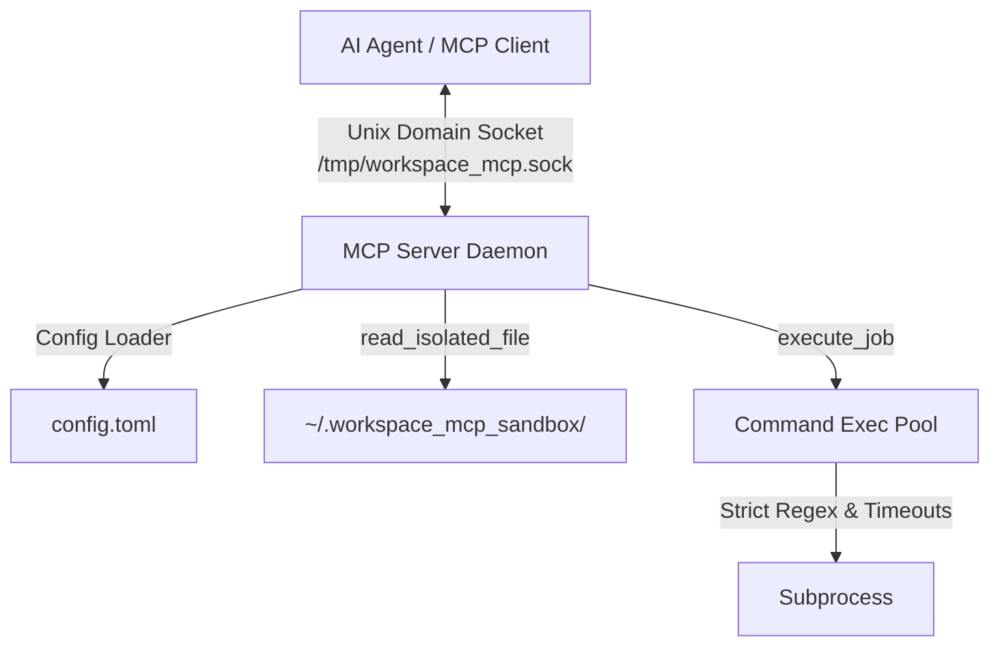

# Secure Local Workspace Model Context Protocol (MCP) Server

A local daemon acting as a Model Context Protocol (MCP) server. It exposes secure, isolated system-level tools to AI agents (MCP Clients). To ensure maximum security and avoid exposing network ports, the daemon communicates exclusively over Unix Domain Sockets (UDS).

---

## 🏗️ Architecture & Security Model

The project is built around strict isolation and security principles to enable local system interaction safely.



### 1. Unix Domain Socket (UDS) Transport
By using Unix Domain Sockets (`/tmp/workspace_mcp.sock`) instead of standard TCP ports (like localhost), we guarantee that:
- The server is **strictly local** and cannot be reached by external network hosts.
- It leverages standard OS file permissions for access control to the socket itself.

### 2. Strict Sandbox Enclosure
The `read_isolated_file` tool restricts access to a pre-defined path (e.g., `~/.workspace_mcp_sandbox/`). 
- Path resolution handles links, home symbols (`~`), and relative elements.
- Employs strict directory traversal checks, raising access errors if a path attempts to escape using `..` or symbolic links pointing outside.

### 3. Declarative Execution Whitelisting
The `execute_job` tool runs shell commands with heavy security restrictions:
- **Binary Whitelisting**: Only explicitly allowed command names mapped to exact, absolute paths (e.g., `/bin/ls`, `/usr/bin/git`) are permitted.
- **Argument Sanitization**: Permitted arguments can be locked down using regular expressions (e.g., only allowing `git status`, or blocking shell chaining operators like `;`, `&&`, `|`).
- **Graceful Timeouts**: Commands run with an asynchronous timeout. If they hang or block, they are automatically terminated (`SIGKILL`/`SIGTERM` cascading) to prevent resource exhaustion.

---

## 📁 Project Structure

```text
workspace-mcp/
├── .gitignore               # Excludes Python artifacts, virtualenvs, sockets, and local configs
├── pyproject.toml           # Project dependencies (mcp, pytest) managed via uv
├── uv.lock                  # Lockfile ensuring reproducible dependency trees
├── README.md                # Project documentation and architecture details
├── config.toml.example      # Template for declarative server security configuration
├── src/workspace_mcp/       # Daemon source code
│   ├── __init__.py          # Python package entry point
│   ├── server.py            # Async UDS server implementation (MCP Server)
│   ├── client.py            # Test client script (JSON-RPC MCP UDS connection)
│   ├── config.py            # Configuration loader and parser
│   └── tools.py             # Sandbox and execution core logic
└── tests/                   # Automated pytest suite
    ├── __init__.py
    ├── test_server.py
    └── test_tools.py
```

---

## ⚙️ Configuration (`config.toml`)

Copy `config.toml.example` to `config.toml` to create your configuration:

```bash
cp config.toml.example config.toml
```

### Example Layout
```toml
[server]
socket_path = "/tmp/workspace_mcp.sock"

[security]
sandbox_directory = "~/.workspace_mcp_sandbox"

[execution]
default_timeout_seconds = 30.0

[[execution.allowed_commands]]
name = "ls"
binary = "/bin/ls"
allowed_arguments_regex = ["^-[la]{1,2}$", "^$"]
```

---

## 🚀 Getting Started

This project uses `uv` for fast Python packaging and dependency management.

### 1. Prerequisites
Ensure you have `uv` installed. If not, install it using:
```bash
curl -LsSf https://astral.sh/uv/install.sh | sh
```

### 2. Environment Setup
Sync the dependencies and initialize the virtual environment:
```bash
uv sync
```

### 3. Run the Server
Startup the daemon, specifying the configuration:
```bash
uv run python -m mcp.server --config config.toml
```

### 4. Run the Client Demonstration
To test the server connection, fetch its tool schemas, and simulate an agent command:
```bash
uv run python -m mcp.client
```

### 5. Running Tests
Run the pytest suite to verify tools and security boundary behavior:
```bash
uv run pytest
```
